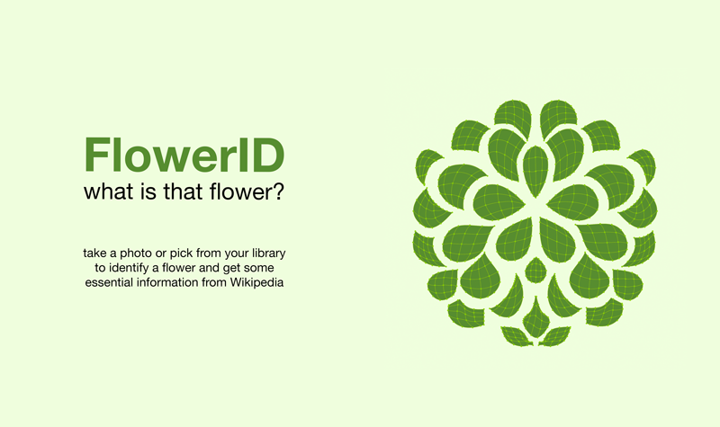
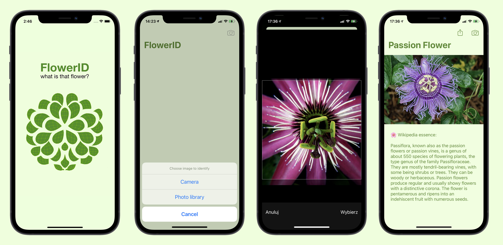
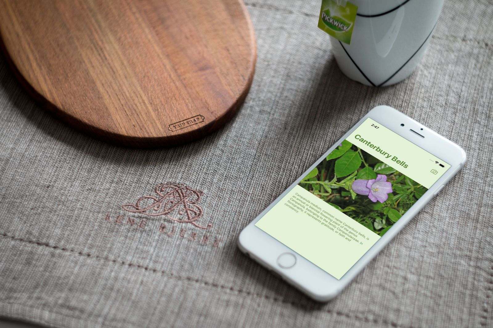

#  FlowerID

 [](https://swift.org/)    [](https://choosealicense.com/licenses/mit/)  [](https://twitter.com/pacholak) 
 
 FlowerID / simple camera-based tool to identify flowers and get some essential information from Wikipedia. Apple MLModel generated from Caffe open source model.

## Screenshots
 


## Technologies
* project is written in Swift
* uses pre-trained machine learning caffe model "caffe-oxford102" from [Jimmie Goode](https://github.com/jimgoo/caffe-oxford102)
* uses *.mlmodel converted by Apple's [CoreML Tools](https://github.com/apple/coremltools)
* uses Wikipedia API to get some essential information about flower and download generic photo
* uses Swift Codable protocol to parse JSON (instead of SwiftyJSON) & uses classic Swift networking (instead of Alamofire)
* uses [SDWebImage](https://cocoapods.org/pods/SDWebImage) to download an image from Wikipedia


## Code example
It is a simple app, so no spectacular code example here. But this passing-image-to-detect()-function could be consider as a characteristic part of this app

```swift
private func detect(image: CIImage) {
    
    let config = MLModelConfiguration()
    guard let coreMLModel = try? FlowerClassifier(configuration: config),
          let model = try? VNCoreMLModel(for: coreMLModel.model) else { fatalError("Loading CoreML Model Failed") }
    
    let request = VNCoreMLRequest(model: model) { (request, error) in
        guard let classification = request.results?.first as? VNClassificationObservation else { fatalError("Unable to classify image") }

        self.navigationItem.title = classification.identifier.capitalized
        let flowerStringName = self.navigationItem.title?.addingPercentEncoding(withAllowedCharacters: CharacterSet.urlFragmentAllowed)
        self.flowerManager.fetchData(flowerName: flowerStringName ?? "rose")
        
        if let flowerSafeName = self.navigationItem.title {
            self.flowerName = flowerSafeName
        }
    }
    
    let handler = VNImageRequestHandler(ciImage: image)
    
    do {
        try handler.perform([request])
    } catch {
        print(error)
    }
}
```

---


## Status
Project is _in progress_ so there are still some **things to do**:
* add "save favourites" feature
* add "share" feature
* implement tableView

---



## Dependencies
I did not include into repository the CocoaPods dependecies, so you can find them here:
* [SDWebImage](https://cocoapods.org/pods/SDWebImage) by Olivier Poitrey
* *mlmodel file is too large to upload it to this repo. You need to create your own from pre-trained machine learning caffe model "caffe-oxford102" from [Jimmie Goode](https://github.com/jimgoo/caffe-oxford102). You'll need Apple's [CoreML Tools](https://github.com/apple/coremltools)


## Inspiration
Project inspired by Angela's Yu app.


## Contact
Created by [@pacholak](https://twitter.com/pacholak) - feel free to contact me!


## License
[MIT](https://choosealicense.com/licenses/mit/)
